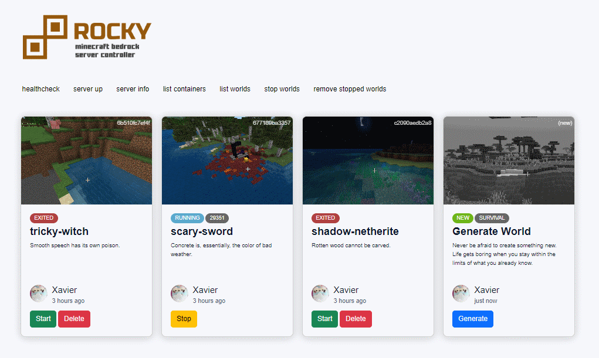

# TL/DR

ROCKY is a container manager for Minecraft Bedrock instances.

It uses the [Docker Engine API](https://docs.docker.com/engine/api/v1.38/) to create, run, stop and manage existing containers.

Each world is a self-contained instance running an image of minecraft bedrock.



###  Powered by the the following projects:


# Installation

You will need [Docker](https://docs.docker.com/get-docker/) installed. 

It has been developed using version `1.19.03` but any newer version should work fine.

```sh
$ docker -v
Docker version 19.03.1, build 74b1e89e8a
$ docker build -t rocky .
$ docker run -p 8060:8060 rocky
```

Optionally, you may also install [Docker Compose](https://docs.docker.com/compose/install/) to make it easier to update your installation with `docker-compose down` and `docker-compose up` commands.

```sh
# Start the server
$ docker-compose up
```

```sh
# Update to latest version
$ git pull
$ docker-compose build
$ docker-compose restart
```

# Development

You will need `node.js` installed. Version `16.16.0`.

```sh
$ node -v
v16.16.0
$ npm i
$ npm run dev
```

