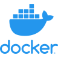

# TL/DR

ROCKY is a container manager, like [Portainer](https://github.com/portainer/portainer), but for Minecraft Bedrock instances.

It uses the [Docker Engine API](https://docs.docker.com/engine/api/v1.38/) to create, run, stop and manage existing containers.

Each world is a container instance running an image of minecraft bedrock.

Click image below for some Screenshots:

[](https://github.com/crafty-monster/rocky/wiki/Screenshots)

## Why?

I promised my kids they could have their own minecraft server. And that they could create new worlds to play with their cousins whenever they wished.

##  What did you use?

This is built on top of some really cool FOSS projects: Docker, Node.js, Express, Vite, Svelte, Bulma.




# Installation

You will need [Docker](https://docs.docker.com/get-docker/) installed since this project is an extra UI for docker that manages minecraft server containers.

It has been developed using version `1.19.03` but any newer version should work fine.

# Quick Start:

To get off the ground quickly you dont even need to download the repository, just use the docker registry image.

```sh
docker run -p 48000:48000 -v /var/run/docker.sock:/var/run/docker.sock -e ROCKY_USER1=admin:123456 ghcr.io/crafty-monster/rocky
```

Then open http://localhost:48000/admin and type in user `admin` and password `123456`

You can also expose UDP ports 48000-49000 through your home router if you want to share your minecraft worlds with your friends.

### Do I really need to share `/var/run/docker.sock`?

Yes. Without this you will not be able to manage the minecraft containers for each of your worlds.

# Running a Server

If you are running a proper server 24/7 you will want to minimize downtime when getting latest patches. 

Install [Docker Compose](https://docs.docker.com/compose/install/) and then run your server as a daemon using `docker-compose up -d` command.

```sh
# There is no need to download the rest of the codebase unless you are developing.
$ curl -O https://raw.githubusercontent.com/crafty-monster/rocky/master/docker-compose.yml
$ docker-compose up -d
```

Every time you want to update you can check for the latest package.

```sh
# Update to latest version & restart
$ docker-compose pull
$ docker-compose up -d
```

# Development

You will need `git` and `node.js` installed. Version `16.16.0`.

```sh
$ git --version
git version 2.36.1
$ node -v
v16.16.0
$ git clone https://github.com/crafty-monster/rocky.git
$ cd ./rocky
$ npm i
$ npm run dev
```

Then open http://localhost:5173/.

# Running a Development Server

If you are developing actively I recommend using the `docker-compose-dev.yml` file for running your own test version of the server against `master` (instead of the github container registry).

```sh
# Start the server from code in github
$ git clone https://github.com/crafty-monster/rocky.git
$ cd ./rocky
$ docker-compose -f docker-compose-dev.yml up --build -d
```

# Manually updating your Development Server 

Every time you want to update you can download the latest code, rebuild run the server again.

```sh
# Update to latest version
$ git pull
$ docker-compose -f docker-compose-dev.yml up --build -d
```

# Automatic Updates

You can automate updates to your Development Server by installing the updater. 

```
$ cd .updater
$ ./install.sh
ROCKY Minecraft Server Controller Updater

crontab -----------------------------------------------------
*/1 * * * * cd /home/lenovouser/projects/rocky/.updater && ./check.sh >> update.log 2>&1
0 * * * * cd /home/lenovouser/projects/rocky/.updater && tail -1000 update.log | cat > update.log
-------------------------------------------------------------

Rocky updater installed. Check the 'update.log' in a minute or two.
```

## Environment variables

Rocky uses the following environment variables which can be updated for a customized experience.

### Required:

- `ROCKY_USER1`: Admin UI user/password, separated by a colon `:`. Defaults to `admin:rocky`. You can have any number of users (ie `ROCKY_USER2`, `ROCKY_USER3` etc). Can be edited directly in the `docker-compose.yml`.

### Optional:

- `ROCKY_MAX_WORLDS`: Maximum number of worlds/containers that can be created and managed (default is `9`).
- `ROCKY_MAX_WORLDS_PER_USER`: Max number of worlds/containers that each user can create (default is `9`)
- `DOCKER_HOST`: Use *only* if Docker not running on `/var/run/docker.sock` (example `192.168.99.101`, default is `blank`).
- `DOCKER_PORT`: Use *only* if docker not running on `/var/run/docker.sock` (example `2376`/https or `2375`/http, default is `blank`)

